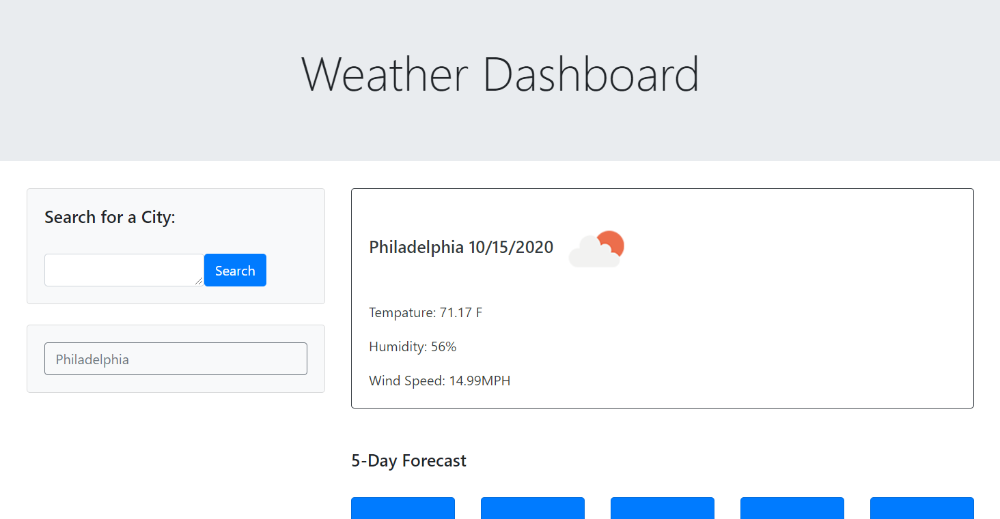

# weatherDashboard

## Description 

WeatherDashboard is a web application that utilizes the Open Weather API.  When the user enters a city and clicks the search button weather data is retrieved.  This dashboard runs in the browser and features dynamically updated HTML and CSS. 

In the Current Weather section the Open Weather API is called and utilized to populate city name, date, the current weather icon, tempature, humidity, and wind speed. 

In the 5 day forecast the Open Weather API is called and utilized to populate the next 5 dates, weather icons, tempature, and humidity.  

When the user searches for a city the application stores that city utilizing local storage.  When the user returns to the site their previously searched city data is still presented.  

## [Link to Deployed Application](https://dmcc789.github.io/weatherDashboard/)

## Technologies used 
* HTML
* Bootstrap CSS Framework
* JavaScript
* JQuery
* Open Weather API

## Screenshot 

 

## License
### [MIT License](https://opensource.org/licenses/MIT)
Copyright 2020 Deirdre Cruice Cabanel